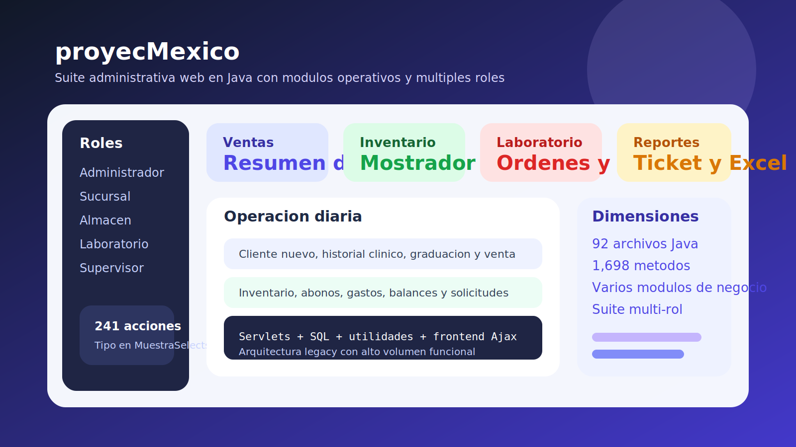

# proyecMexico Showcase

Repositorio publico de portafolio para presentar una suite administrativa web en Java sin publicar el codigo completo del sistema.

Ilustracion de showcase basada en la estructura funcional real del proyecto.

## Resumen

Aplicacion web monolitica en Java para operacion administrativa multi-rol. Por su estructura funcional integra ventas, inventario, laboratorio, reportes, usuarios, clientes y control de sucursales.

## Tecnologias detectadas

- Java Servlet/JSP style
- HTML
- CSS
- JavaScript
- MySQL

## Funcionalidades destacadas

- autenticacion y sesiones por rol
- alta de sucursales, usuarios y catalogos
- clientes, ventas y abonos
- historial clinico y graduaciones
- ordenes de laboratorio y seguimiento
- inventario de mostrador y almacen
- exportacion a Excel y generacion de tickets
- solicitudes especiales y flujos de autorizacion

## Arquitectura funcional

- controladores por acciones `Tipo`
- servlets para autenticacion, reportes y operaciones de negocio
- clases de dominio para clientes, ventas, sucursales, inventario y laboratorio
- frontend legacy conectado por Ajax

## Valor profesional

Este proyecto demuestra trabajo sobre sistemas legacy grandes, con multiples modulos operativos y fuerte acoplamiento entre frontend, negocio y datos.

## Alcance publico

Se publica solo como showcase. El codigo completo, credenciales, despliegues, contratos internos y artefactos de produccion no se exponen en este repositorio.
