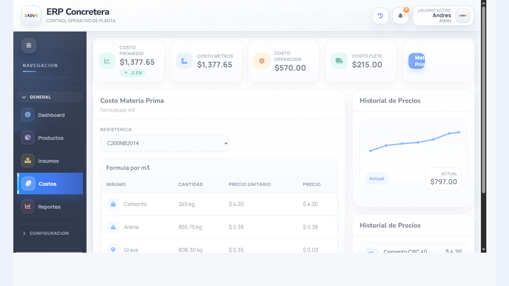

# proyecMexico Showcase

Repositorio publico de portafolio para presentar un ERP operativo de concretera sin publicar el codigo completo del sistema.

Captura real de una interfaz del ERP tomada desde el proyecto local.

## Resumen

Aplicacion web monolitica en Java orientada a operacion de planta concretera. Integra costos, insumos, formulas por m3, historiales de precio, control operativo y modulos administrativos conectados entre si.

## Tecnologias detectadas

- Java Servlet/JSP style
- HTML
- CSS
- JavaScript
- MySQL

## Funcionalidades destacadas

- autenticacion y sesiones por rol
- costos operativos y costo por metro cubico
- formulas, materiales e insumos por planta
- historiales de precio y seguimiento de variaciones
- clientes, ventas, pedidos y remisiones
- inventario, laboratorio, logistica y reportes
- exportacion documental y flujos operativos multi modulo

## Arquitectura funcional

- controladores y modulos web en Java
- capas para operaciones administrativas y operativas de planta
- frontend conectado con Ajax y vistas modulares
- estructuras de dominio para ventas, materiales, costos, remisiones y logistica

## Valor profesional

Este proyecto demuestra trabajo sobre un sistema ERP especializado, con logica de negocio real para planta concretera y multiples dominios conectados dentro de una sola operacion.

## Alcance publico

Se publica solo como showcase. El codigo completo, credenciales, despliegues, contratos internos y artefactos de produccion no se exponen en este repositorio.
